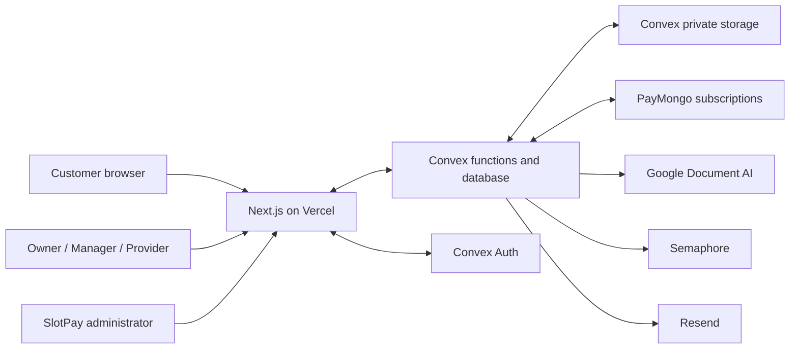
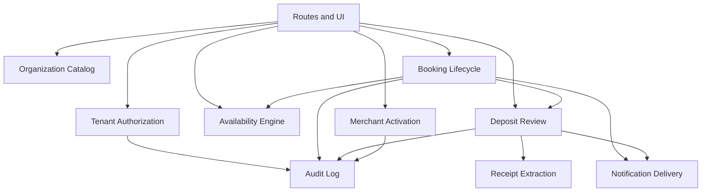
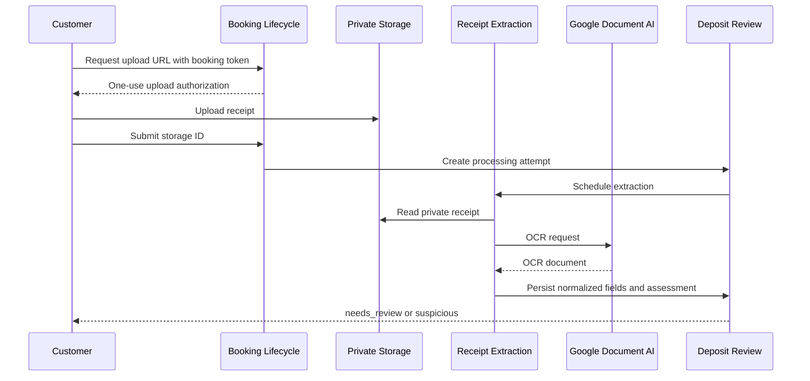

# Architecture

## Status

This document describes the approved target architecture. Phase 1 now implements the Convex backend, Convex Auth entry flow, tenant/platform authorization foundation, Audit Events, and CI. Booking, receipt, notification, billing, and third-party provider modules remain target architecture for later phases.

## System context

SlotPay never moves or holds Deposit funds. Customers transfer directly to an Organization's Payment Destination.

## Runtime responsibilities

### Next.js

- Renders the public booking experience, authenticated business dashboard, and platform-administration screens.
- Uses the server-first policy in [Next.js standards](NEXTJS-STANDARDS.md): static prerendering for stable public content, Server Components and streaming for request-time content, and small client islands for Convex reactivity or browser interaction.
- Never receives long-lived Google, Semaphore, Resend, or Convex administration secrets in client code.
- Uses Convex Auth for Member and Platform Administrator authentication; Customers remain accountless.
- Keeps authenticated application data client-driven while authenticated Convex server rendering remains beta and provider-dependent. Public-safe data and route shells render server-side; authenticated preloading requires documented provider support plus preview security testing.

### Convex

- Is the sole application backend, database, file store, scheduler, and realtime data source.
- Runs all authorization, availability, slot claiming, lifecycle transitions, audit recording, and retention decisions.
- Uses mutations for atomic state changes, queries for indexed reads, actions for external calls, and internal functions for scheduled or privileged work.
- Uses `convex-helpers` custom functions to inject authenticated Member and Organization context.
- Uses the Convex rate-limiter component for public OTP, availability, booking, token, and upload operations.
- Owns Subscription state, usage metering, entitlements, SMS Credits, PayMongo webhook handling, and platform sales metrics.

### External adapters

- Google Document AI Enterprise OCR extracts text and layout. Provider-specific parsers map OCR output into normalized fields.
- Semaphore sends transactional SMS. Resend provides email fallback.
- PayMongo manages recurring SaaS Subscription payments. Only verified, idempotent webhooks update paid entitlement.
- Cloudflare Turnstile is verified server-side before abuse-sensitive public mutations.
- External calls execute in Convex actions and persist results through internal mutations.

## Deep modules

| Module | Interface | Hidden complexity |
| --- | --- | --- |
| Tenant Authorization | Resolve the authenticated Member and assert an Organization capability | Auth identity mapping, membership status, role checks, tenant scoping |
| Organization Catalog | Read and update the public profile, Services, Providers, and Payment Destinations | Publication rules, slug uniqueness, activation state, sensitive-field redaction |
| Availability Engine | List available starts; atomically claim or move Provider time | Weekly rules, exceptions, duration, active holds, overlap checks, deterministic assignment |
| Booking Lifecycle | Create and transition one Booking through approved states | OTP handoff, expiry, cancellations, reschedules, deposit prerequisites, notifications |
| Deposit Review | Submit, assess, accept, reject, or record a Deposit | Idempotency, duplicates, mismatch rules, role checks, audit history |
| Receipt Extraction | Extract normalized receipt fields | Private file reads, Google OCR, provider templates, confidence, retries, parser versions |
| Notification Delivery | Enqueue a message intent | Templates, recipient selection, idempotency, channel fallback, retries, cost controls |
| Merchant Activation | Submit and decide a publication review | Evidence access, reviewer separation, retention, suspension |
| Audit Log | Append and query security-sensitive changes | Actor attribution, immutable snapshots, pagination, redaction |

The interface of each module is also its primary test surface. Provider-specific integrations are adapters at internal seams; callers do not depend on their SDK types.

## Authorization model

All client-callable protected Convex functions must:

1. Obtain the authenticated identity.
2. Resolve a local user and active Organization membership.
3. Assert a named capability derived from `owner`, `manager`, or `provider`.
4. scope every indexed read and write by `organizationId`.

Public functions expose only an activated Organization's public profile, active Services, and computed availability. Customer Booking functions require either a short-lived OTP challenge or a hashed Booking Access Link token. Platform-administration functions require a separate platform role and do not infer access from Organization ownership.

Convex does not provide database row-level security. Tenant isolation is an application invariant enforced by shared custom query/mutation wrappers and tested against every public function.

## Availability and concurrency

Availability is computed rather than pre-generated:

1. Load eligible Providers for the Service.
2. Apply weekly availability and dated exceptions.
3. Subtract active provisional holds, payment holds, protected reviews, and non-terminal Bookings.
4. Return starts aligned to the Organization's booking interval.
5. On claim, recompute inside one mutation and insert the hold only if no overlap exists.

For “any Provider,” assignment is deterministic: choose the eligible Provider with the fewest active appointments that day, then stable-sort by Provider ID. A reschedule claims the replacement time and releases the old time in one mutation.

## Async processing

Actions must be idempotent at the business-operation level. Retries use a stable operation key and may not create duplicate Payment Attempts, messages, or Audit Events.

## Deployment topology

- Local development uses a developer Convex deployment.
- Each Vercel preview uses a branch-specific Convex preview deployment.
- Protected `main` deploys the production Convex functions and then builds the matching Next.js frontend through `npx convex deploy --cmd "npm run build"`.
- Environment secrets are configured independently for development, preview, and production.

See [CI/CD](CI-CD.md) for gates and [Security](SECURITY.md) for trust boundaries.
