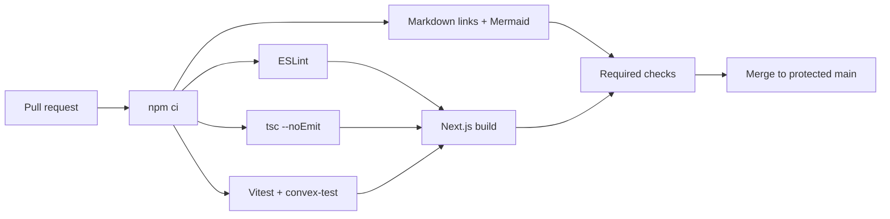

# CI/CD and environments

## Goals

- A pull request cannot merge when lint, types, tests, build, or documentation checks fail.
- Each Vercel preview uses the matching Convex preview deployment.
- Frontend and backend are released together from protected `main`.
- CI never uses production customer data or prints secrets.

## Local development

Implemented local scripts:

| Script | Purpose |
| --- | --- |
| `npm run dev` | Run Next.js development server alongside the selected Convex development workflow |
| `npm run lint` | Run ESLint without rewriting files |
| `npm run typecheck` | Run `tsc --noEmit` |
| `npm test` | Run Vitest once, including `convex-test` suites |
| `npm run test:watch` | Run focused tests during development |
| `npm run build` | Build the production Next.js application |
| `npm run docs:check` | Validate Markdown links and Mermaid syntax |

## Pull-request CI

The foundation workflow is implemented in `.github/workflows/ci.yml`.



The workflow should:

1. Check out the exact commit.
2. Select the pinned Node.js major and enable npm caching.
3. Run `npm ci` against the committed lockfile.
4. Run lint, typecheck, tests, documentation checks, and production build.
5. Use synthetic test fixtures only.
6. Cancel superseded runs for the same branch.
7. Grant read-only repository permissions unless a job explicitly requires more.

The current workflow implements these repository-side controls. Protected-branch enforcement and preview deployment remain external deployment follow-up before the Phase 1 exit gate can be closed.

External integrations are replaced by adapters in unit tests. A separate opt-in smoke test may use preview credentials after the preview backend exists.

## Test layers

| Layer | Tool | Required coverage |
| --- | --- | --- |
| Domain/unit | Vitest | Status transitions, amount/reference normalization, parser templates, permission matrix, reminder timing |
| Convex functions | `convex-test` | Tenant isolation, indexed reads, slot concurrency, idempotency, audit coupling, retention |
| UI/component | Testing Library | Booking steps, status rendering, permission-based actions, accessible validation |
| End-to-end | Playwright | Activated merchant onboarding, public booking, Receipt review, cancellation/reschedule |
| Preview smoke | Real preview deployment | Auth, storage upload, scheduled work, and configured provider sandbox calls |

## Required scenarios

- Cross-tenant IDs fail for every protected query and mutation.
- Disabled Members and wrong roles cannot access private data.
- Concurrent overlapping Provider claims produce one winner.
- Expired OTP/payment holds release inventory.
- Receipt submission replaces the expiring hold with protected review.
- OCR outage or unreadable content routes to manual review.
- Duplicate reference/image signals never verify or expose another Organization.
- Only Owner/Manager can view Receipts or decide Deposits.
- Acceptance confirms exactly once and schedules each message once.
- Cancellation and rescheduling preserve payment and Audit history.
- Receipt deletion removes storage but retains structured history.
- Merchant pages cannot expose payment instructions before activation.

## Preview deployment

Vercel owns preview deployment. Configure a Convex preview deploy key in Vercel and use:

```text
npx convex deploy --cmd "npm run build"
```

Convex creates or reuses a deployment associated with the branch and supplies its URL to the frontend build. Preview data, functions, scheduled work, Auth configuration, and environment variables are isolated from production.

Preview seeding must use an idempotent internal function and synthetic identities, Bookings, and Receipts. Never import production exports into preview.

<!-- VERIFY: Vercel and Convex projects, deploy keys, environment variables, and preview seed functions do not exist in this repository yet. -->

## Production deployment

1. Require pull request review and all CI checks on `main`.
2. Vercel starts the coordinated Convex deployment and frontend build.
3. Convex typechecks, generates types, validates schema/indexes, and deploys functions.
4. The Next.js build runs against the deployed production Convex URL.
5. Vercel promotes the successful artifact.
6. Run a read-only health check and one synthetic critical-flow smoke test.

Schema changes on populated tables follow widen → migrate → narrow. New required fields are initially optional, backfilled in bounded batches, verified, and tightened in a later release.

Rollback strategy:

- Frontend: promote the last known-good Vercel deployment.
- Convex functions: redeploy the last compatible commit.
- Schema/data: prefer forward repair; never assume code rollback can reverse a data migration.
- External-provider incidents: disable the adapter through a server-side feature flag and preserve manual operation.

## Environment matrix

| Environment | Data | External providers | Purpose |
| --- | --- | --- | --- |
| Local/developer | Synthetic/personal dev | Stub by default; sandbox when explicitly enabled | Daily development |
| Preview | Synthetic branch-isolated | Sandbox/test credentials | Review and end-to-end validation |
| Production | Real tenant data | Production credentials | Customer traffic |

Expected secret categories include Convex deployment and Convex Auth configuration, PayMongo API and webhook secrets, Google Document AI project/processor credentials, Semaphore API key and sender name, Resend API key/domain, Turnstile secret, and application origin. Exact variable names will be defined when each adapter is implemented.

## Operations and release checks

Alert on:

- failed or delayed Receipt extraction;
- overdue Deposit reviews;
- SMS credit depletion and elevated delivery failure;
- notification retry exhaustion;
- retention jobs falling behind;
- repeated OTP, hold, or upload rate-limit violations;
- authorization failures that suggest enumeration or cross-tenant attempts.

Every production release records commit SHA, Convex deployment, Vercel deployment, schema/migration actions, and smoke-test outcome.
