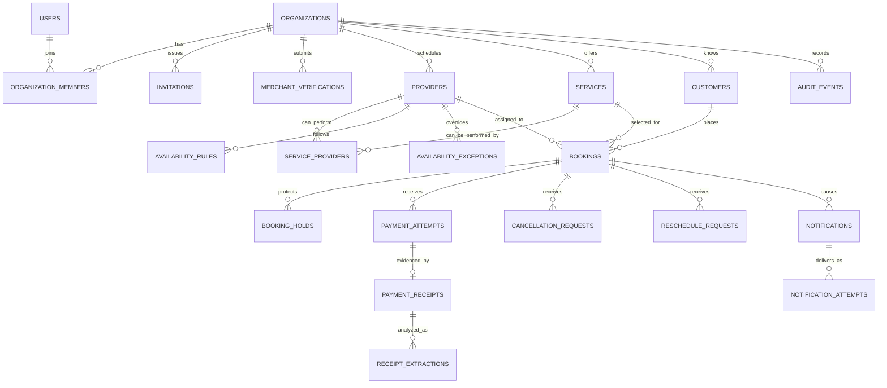

# Convex data model

> Implementation note (Phase 2): `organizations`, `subscriptions`, `services`, `providers`, `serviceProviders`, `availabilityRules`, `availabilityExceptions`, `paymentDestinations`, and `merchantVerifications` are represented in the Convex schema. Later booking, receipt, notification, and billing entities below remain target-state models.

## Conventions

- IDs are Convex document IDs, never unvalidated strings.
- Money is stored as integer Philippine centavos. V1 currency is always `PHP`.
- Instants are Unix epoch milliseconds. Business-local dates use `YYYY-MM-DD`; local times use `HH:mm`.
- V1 Organization timezone is `Asia/Manila`.
- Every tenant-owned table includes `organizationId` and every tenant read begins with an index containing it.
- Fixed sets use literal unions in Convex validators.
- Public functions return purpose-built view models rather than raw documents.
- File records store `Id<"_storage">`, never signed or expiring URLs.

## Relationships

## Tables

### Identity and tenancy

**users**

- `authUserId`: identity supplied by Convex Auth
- `displayName`, `email`, `mobileE164`
- `platformRole`: optional `platform_admin`
- `disabledAt`: optional timestamp
- Index: `by_auth_user_id`

**organizations**

- `name`, `slug`, `description`
- `timezone`: `Asia/Manila`
- `currency`: `PHP`
- `address`: structured street/locality/region/postal fields
- `addressVisibility`: `public` or `after_confirmation`
- `bookingIntervalMinutes`: default `15`
- `paymentHoldMinutes`: default `30`
- `activationStatus`: `draft`, `submitted`, `active`, `rejected`, `suspended`
- `betaStatus`: `active`, `paused`, `ended`
- `publishedAt`, `suspendedAt`: optional timestamps
- Indexes: `by_slug`, `by_activation_status`

Slug normalization is lowercase ASCII with hyphens. Creation and rename mutations check `by_slug` atomically.

**organizationMembers**

- `organizationId`, `userId`
- `role`: `owner`, `manager`, `provider`
- `status`: `invited`, `active`, `disabled`
- Indexes: `by_organization_id`, `by_user_id`, `by_organization_id_and_user_id`

At least one active Owner must remain. Ownership transfer and Member disablement are audited.

**invitations**

- `organizationId`, `email`, `role`
- `tokenHash`, `expiresAt`, `acceptedAt`, `revokedAt`
- `invitedByUserId`
- Indexes: `by_token_hash`, `by_organization_id_and_email`

**merchantVerifications**

- `organizationId`, `status`: `submitted`, `approved`, `rejected`
- `submittedByUserId`, `reviewedByUserId`
- `evidenceStorageIds`: private files
- `decisionReason`, `submittedAt`, `decidedAt`, `deleteEvidenceAt`
- Indexes: `by_organization_id`, `by_status`

Evidence is available only to platform administrators and is deleted after the documented post-decision retention period. The decision and Audit Event remain.

### Catalog and scheduling

**providers**

- `organizationId`, optional `memberId`
- `displayName`, `active`
- Indexes: `by_organization_id`, `by_organization_id_and_active`, `by_member_id`

A Provider may exist without a login. A Provider linked to a Provider-role Member is still governed by membership authorization.

**services**

- `organizationId`, `name`, `description`
- `priceCentavos`, `depositCentavos`, `durationMinutes`
- `active`, `sortOrder`
- Indexes: `by_organization_id`, `by_organization_id_and_active`

Validation requires non-negative integer amounts, a positive duration aligned to the booking interval, and a Deposit no greater than the service price.

**serviceProviders**

- `organizationId`, `serviceId`, `providerId`
- Indexes: `by_organization_id_and_service_id`, `by_organization_id_and_provider_id`, `by_service_id_and_provider_id`

**availabilityRules**

- `organizationId`, `providerId`, `weekday`
- `startLocalTime`, `endLocalTime`, `active`
- Index: `by_organization_id_and_provider_id_and_weekday`

Multiple non-overlapping windows per Provider/day are allowed.

**availabilityExceptions**

- `organizationId`, `providerId`, `localDate`
- `kind`: `unavailable` or `available`
- `startLocalTime`, `endLocalTime`, `reason`
- Index: `by_organization_id_and_provider_id_and_local_date`

**customers**

- `organizationId`, `name`, `mobileE164`, optional `email`
- `lastBookingAt`
- Indexes: `by_organization_id_and_mobile_e164`, `by_organization_id_and_last_booking_at`

Customer records are Organization-local. SlotPay does not create a global customer profile.

**otpChallenges**

- `organizationId`, `mobileE164`, `purpose`: `booking_phone`
- `codeHash`, `expiresAt`, `attemptCount`, `verifiedAt`
- `requestFingerprintHash`
- Indexes: `by_organization_id_and_mobile_e164`, `by_expires_at`

Raw OTPs are never stored. Creation and verification are rate-limited by Organization, phone, IP/fingerprint, and challenge.

**bookings**

- `organizationId`, `publicCode`, `customerId`, `serviceId`, `providerId`
- `source`: `public`, `staff`, `walk_in`, `phone`, `messenger`
- `startAt`, `endAt`
- immutable snapshots: `serviceName`, `priceCentavos`, `depositCentavos`, `durationMinutes`
- `appointmentStatus`: `pending`, `confirmed`, `completed`, `cancelled`, `no_show`, `expired`
- `depositStatus`: `awaiting_payment`, `processing`, `needs_review`, `suspicious`, `verified`, `rejected`, `refund_due`, `refunded_external`, `retained`
- `bookingAccessTokenHash`, `bookingAccessExpiresAt`
- `createdByUserId`: optional for public bookings
- `confirmedAt`, `completedAt`, `cancelledAt`, `expiredAt`: optional timestamps
- Indexes:
  - `by_organization_id_and_public_code`
  - `by_organization_id_and_provider_id_and_start_at`
  - `by_organization_id_and_customer_id_and_start_at`
  - `by_organization_id_and_appointment_status_and_start_at`
  - `by_booking_access_token_hash`

Snapshots prevent later Service edits from changing historical financial or scheduling facts.

**bookingHolds**

- `organizationId`, `bookingId`, `providerId`
- `kind`: `otp`, `payment`, `receipt_review`
- `startAt`, `endAt`, optional `expiresAt`
- `releasedAt`, `releaseReason`: optional
- Indexes:
  - `by_organization_id_and_provider_id_and_start_at`
  - `by_booking_id`
  - `by_expires_at`

OTP and payment holds expire automatically. A `receipt_review` hold has no automatic expiry and remains until staff decides the attempt.

**cancellationRequests**

- `organizationId`, `bookingId`, `requestedBy`: `customer` or `member`
- `reason`, `status`: `open`, `approved`, `declined`
- `decidedByUserId`, `decisionReason`, timestamps
- Indexes: `by_organization_id_and_status`, `by_booking_id`

**rescheduleRequests**

- `organizationId`, `bookingId`, `requestedBy`
- optional preferred date/time note
- `status`: `open`, `approved`, `declined`
- old/new Provider and schedule snapshots, decision fields, timestamps
- Indexes: `by_organization_id_and_status`, `by_booking_id`

### Deposits and receipts

**paymentDestinations**

- `organizationId`, `type`: `gcash`, `maya`, `bank_transfer`
- `label`, `recipientName`, encrypted/masked destination details
- `instructions`, `active`, `ownershipAttestedAt`, `attestedByUserId`
- Indexes: `by_organization_id`, `by_organization_id_and_active`

Only a minimal masked view is exposed before a verified Booking flow requires the full instructions.

**paymentAttempts**

- `organizationId`, `bookingId`, `paymentDestinationId`
- `attemptNumber`, `source`: `receipt`, `staff_recorded`, `provider_webhook`
- `claimedAmountCentavos`
- `status`: `processing`, `needs_review`, `suspicious`, `verified`, `rejected`
- `normalizedProvider`, `normalizedReference`, `referenceHash`
- `decisionByUserId`, `decisionReason`, `decidedAt`
- `idempotencyKey`
- Indexes:
  - `by_organization_id_and_status`
  - `by_booking_id_and_attempt_number`
  - `by_organization_id_and_reference_hash`
  - `by_reference_hash`
  - `by_idempotency_key`

The global reference-hash index is queried only by an internal assessment function. Tenant callers receive a duplicate signal, never another Organization's identity or data.

**paymentReceipts**

- `organizationId`, `paymentAttemptId`, `storageId`
- `mimeType`, `byteSize`, `contentHash`
- `uploadedAt`, `deleteAt`, `deletedAt`
- Indexes: `by_payment_attempt_id`, `by_content_hash`, `by_delete_at`

Allow only supported image types and enforce file-size and image-dimension limits before processing.

**receiptExtractions**

- `organizationId`, `paymentReceiptId`, `parserVersion`
- `ocrProvider`: `google_document_ai`
- normalized fields with per-field confidence and source text
- `assessment`: `likely_match`, `needs_review`, `suspicious`, `unreadable`
- `signals`: literal anomaly codes
- `rawResponseStorageId`: optional, short-lived private diagnostic artifact
- `createdAt`
- Indexes: `by_payment_receipt_id`, `by_organization_id_and_assessment`

Every extraction is append-only so parser changes do not erase the basis of an earlier staff decision.

### Notifications and operations

**plans**

- `code`, `name`, `monthlyPriceCentavos`, `currency`: `PHP`
- `bookingLimit`, `memberLimit`, `receiptExtractionLimit`
- `active`
- Index: `by_code`

The launch Plan is ₱499 per month with limits of 150 Bookings, three active Members, and 150 Receipt Extractions per billing period.

**subscriptions**

- `organizationId`, `planCode`
- `provider`: `paymongo` or `manual`
- optional `providerCustomerId`, `providerSubscriptionId`
- `status`: `trialing`, `incomplete`, `active`, `past_due`, `unpaid`, `cancelled`, `manual_review`
- `trialStartsAt`, `trialEndsAt`
- optional `currentPeriodStartsAt`, `currentPeriodEndsAt`, `graceEndsAt`, `cancelAtPeriodEnd`
- Indexes: `by_organization_id`, `by_provider_subscription_id`, `by_status`

One Organization has one current Subscription. Historical provider events and Audit Events preserve how it reached that state.

**billingEvents**

- `organizationId`: optional until a provider customer is resolved
- `provider`: `paymongo`
- `providerEventId`, `eventType`, `payloadHash`
- `processingStatus`: `received`, `processed`, `ignored`, `failed`
- `receivedAt`, optional `processedAt`, `failureReason`
- Indexes: `by_provider_event_id`, `by_processing_status_and_received_at`

Provider event IDs are unique. Webhook processing verifies the signature before persistence and applies Subscription changes idempotently.

**usagePeriods**

- `organizationId`, `periodStart`, `periodEnd`
- `bookingsCreated`, `receiptExtractions`, `activeMemberPeak`
- Index: `by_organization_id_and_period_start`

Usage increments and the guarded business operation occur atomically so concurrent requests cannot exceed Plan limits.

**smsCreditLedger**

- `organizationId`, `amount`
- `type`: `purchase`, `usage`, `adjustment`, `refund`
- `reference`, `occurredAt`, optional `createdByUserId`
- Indexes: `by_organization_id_and_occurred_at`, `by_reference`

Ledger entries are append-only. Balance is derived from entries and cannot become negative.

**entitlementAdjustments**

- `organizationId`, `kind`: `trial_extension`, `manual_subscription`, `booking_limit`, `member_limit`, `receipt_extraction_limit`
- optional `amount`, `startsAt`, `expiresAt`
- `reason`, `createdByUserId`, `createdAt`
- Index: `by_organization_id_and_expires_at`

Adjustments are time-bounded and audited. They do not rewrite Subscription or usage history.

**platformAdminNotes**

- `organizationId`, `authorUserId`
- `category`: `activation`, `billing`, `support`, `risk`
- `body`, `createdAt`
- Index: `by_organization_id_and_created_at`

Notes are internal, append-only support context and must not contain secrets or full Receipt contents.

**notifications**

- `organizationId`, optional `bookingId`
- `kind`, `channelPreference`, `recipient`
- `templateData`, `dueAt`, `status`: `scheduled`, `sending`, `sent`, `failed`, `cancelled`
- `idempotencyKey`
- Indexes: `by_status_and_due_at`, `by_booking_id`, `by_idempotency_key`

**notificationAttempts**

- `organizationId`, `notificationId`, `channel`: `sms` or `email`
- `provider`: `semaphore` or `resend`
- `providerMessageId`, `status`, `errorCode`, `attemptedAt`
- Index: `by_notification_id`

**auditEvents**

- `organizationId`: optional for platform-only events
- `actorType`: `member`, `customer_token`, `platform_admin`, `system`
- actor IDs where applicable
- `action`, `targetType`, `targetId`
- `reason`, `before`, `after`, `occurredAt`
- Indexes: `by_organization_id_and_occurred_at`, `by_target_type_and_target_id`

Audit Events are append-only and paginated. Secrets, full Receipt contents, OTPs, and access tokens must never appear in snapshots.

## Invariants

1. Every protected tenant operation proves active membership before accessing tenant data.
2. A Provider cannot have overlapping active holds or non-terminal Bookings.
3. Exactly one verified Payment Attempt can satisfy a Booking Deposit.
4. OCR and Match Assessment cannot set `verified`.
5. A confirmed Booking with a required Deposit has `depositStatus = verified`.
6. A Receipt under review keeps the assigned Provider time protected.
7. Terminal records are retained; status changes replace deletion.
8. Financial and schedule decisions always append an Audit Event in the same mutation.
9. Notification and external-processing operations are idempotent.
10. Original Receipt storage is deleted on schedule without removing its structured audit history.
11. Merchant Activation and Subscription entitlement are independent requirements for accepting new public Bookings.
12. Browser redirects and client claims never grant paid entitlement; only verified provider events or audited, expiring administrative adjustments do.
13. Billing restrictions preserve read access to existing Organization data.
14. Usage counters and the capability they guard change atomically.

## Schema evolution

For populated Convex tables, add fields as optional, deploy, backfill in bounded batches, and only then make them required. Every query path must use a declared index and pagination or bounded `take`; unbounded collection and table filtering are prohibited.
