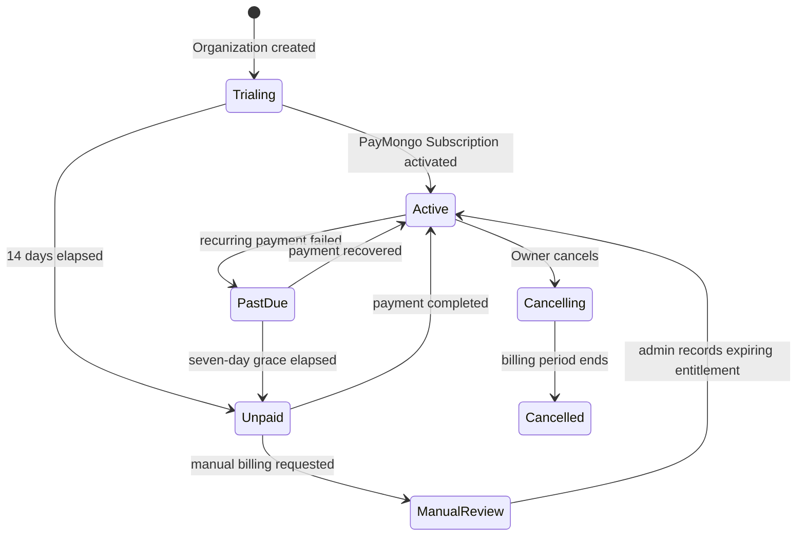
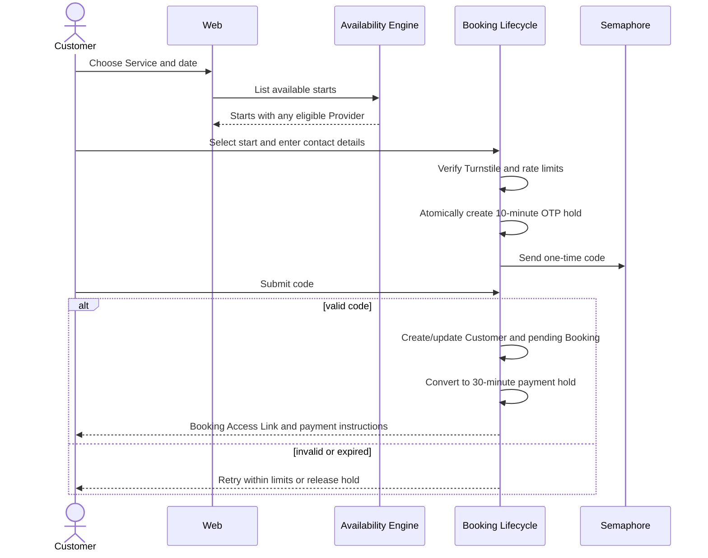
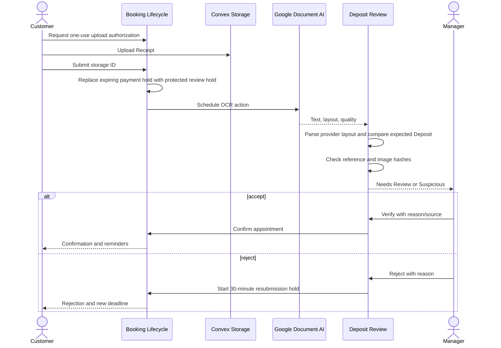
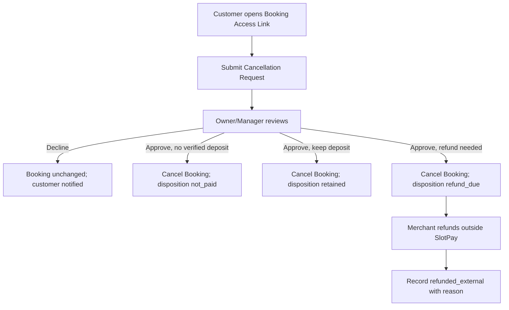
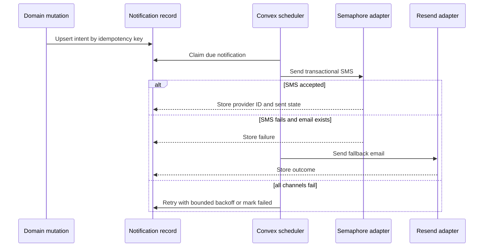

# Product flows

## Merchant onboarding and activation

```mermaid
sequenceDiagram
  actor Owner
  participant Web as SlotPay web
  participant Auth as Convex Auth
  participant Backend as Convex
  actor Admin as Platform admin

  Owner->>Auth: Sign up / sign in
  Auth-->>Web: Authenticated identity
  Owner->>Backend: Create Organization
  Owner->>Backend: Configure profile, location, Services, Providers, availability, payment destinations
  Owner->>Backend: Attest payment-account control
  Owner->>Backend: Submit merchant evidence
  Backend-->>Owner: Preview available; deposit collection disabled
  Admin->>Backend: Review identity and business evidence
  alt approved
    Admin->>Backend: Activate Organization
    Backend-->>Owner: Public booking and payment instructions enabled
  else rejected
    Admin->>Backend: Reject with reason
    Backend-->>Owner: Correct and resubmit
  end
```

An unactivated Organization may finish setup and preview its page. It may not expose payment instructions or accept public Deposit evidence.

## Trial, subscription, and entitlement



Merchant Activation and Subscription state remain independent. An Organization must be both activated and entitled to receive new public Bookings. Billing restrictions never hide existing Bookings or Customer data. Only a verified, idempotent PayMongo webhook or an audited Platform Administrator adjustment changes paid entitlement.

## Public booking, OTP, and payment hold



The provisional hold prevents the chosen time from disappearing during OTP delivery. Phone, device/IP fingerprint, Organization, and challenge limits constrain abuse.

## Receipt submission and review

```mermaid
stateDiagram-v2
  [*] --> AwaitingPayment: OTP verified
  AwaitingPayment --> Expired: 30 minutes; no receipt/payment
  AwaitingPayment --> Processing: receipt submitted
  Processing --> NeedsReview: readable, no strong anomaly
  Processing --> Suspicious: mismatch, duplicate, or unusual structure
  Processing --> NeedsReview: OCR unavailable/unreadable
  NeedsReview --> Verified: owner/manager accepts
  Suspicious --> Verified: owner/manager accepts with reason
  NeedsReview --> Rejected: owner/manager rejects
  Suspicious --> Rejected: owner/manager rejects
  Rejected --> AwaitingPayment: open 30-minute resubmission window
  Rejected --> Expired: resubmission window expires
  Verified --> [*]
  Expired --> [*]
```





The protected review hold does not auto-expire. Overdue reviews create dashboard alerts and notification escalation rather than risking a second customer paying for the same time.

## Staff-created booking

1. Owner or Manager selects or creates an Organization-local Customer.
2. Staff selects Service, time, and optionally a Provider.
3. The Availability Engine claims an eligible Provider atomically.
4. Staff chooses whether the configured Deposit is already externally verified or should be requested.
5. If requested, SlotPay sends the Booking Access Link and starts the payment window.
6. If externally verified, staff records source and reason; the Booking is confirmed and audited without requiring a Receipt.

## Cancellation



Cancellation releases future Provider time, cancels pending reminders, preserves all Booking and Deposit history, and records an Audit Event.

## Rescheduling

1. Customer submits a Reschedule Request with optional preferences.
2. Owner or Manager selects a replacement time and Provider.
3. One mutation verifies the replacement, claims it, updates Booking schedule snapshots, and releases the previous time.
4. The existing verified Deposit remains attached.
5. Old reminders are cancelled; new confirmation and reminder intents are scheduled.
6. If no replacement is acceptable, staff declines the request and the original Booking remains unchanged.

Customers cannot self-reschedule in V1.

## Appointment completion

- Owner or Manager marks a confirmed Booking `completed` or `no_show`.
- A Provider may mark only an assigned Booking completed if the capability matrix permits it; they cannot alter Deposit state.
- Completion schedules Receipt deletion for 90 days later.
- Cancellation or expiry also schedules deletion relative to the terminal timestamp.

## Notification delivery



Templates remain transactional and concise. SMS messages use the registered SlotPay sender name and full SlotPay domain rather than public URL shorteners.
