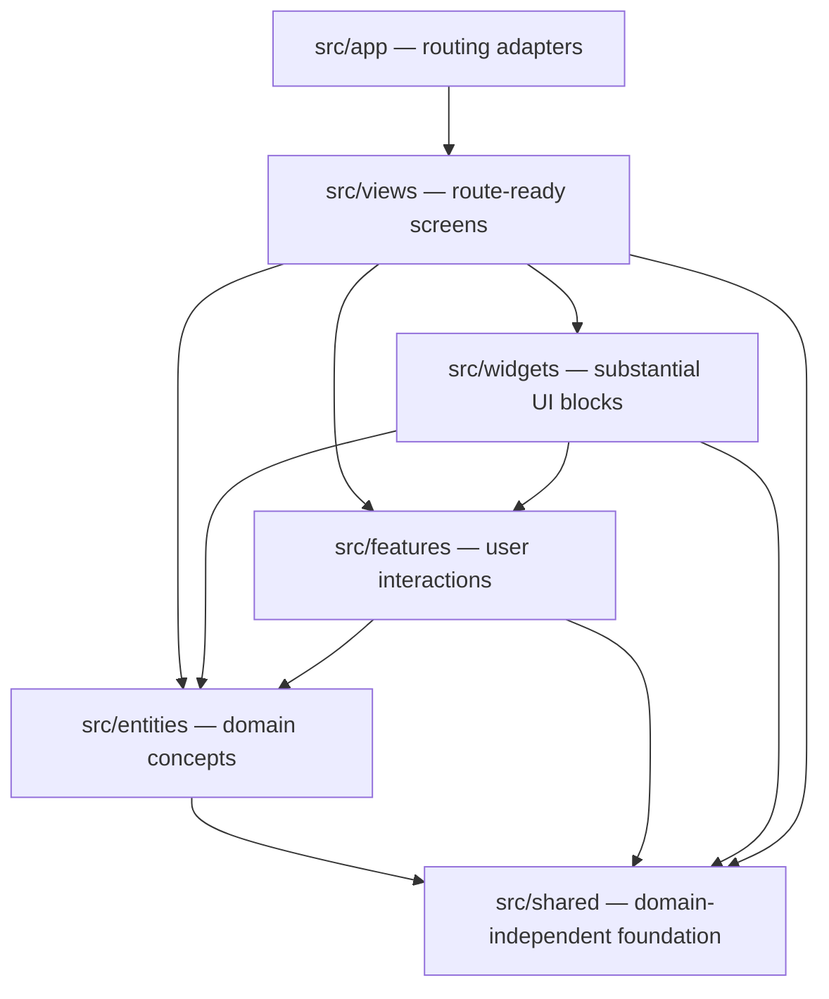

# Folder structure

SlotPay PH uses a pragmatic Feature-Sliced Design structure adapted to Next.js App Router. Next.js owns routing in `src/app/`; product modules live beside it under `src/`.

## Current structure

```text
src/
├── app/                     Next.js routing and global framework files
│   ├── globals.css
│   ├── layout.tsx
│   └── page.tsx             Thin route adapter; renders a view
├── views/                   Complete route-ready screens
│   └── home/
│       ├── index.ts         Slice interface
│       └── ui/
│           └── home-page.tsx
└── shared/                  Domain-independent foundation
    ├── lib/
    │   ├── index.ts         Segment interface
    │   └── cn.ts
    └── ui/
        ├── index.ts         Segment interface
        └── button.tsx

public/                      Static assets
docs/                        Product and engineering decisions
```

Do not create empty `entities`, `features`, or `widgets` directories. Add a slice when real code belongs there.

## Target layers

Imports flow downward only:



| Layer | Put here | SlotPay examples |
| --- | --- | --- |
| `src/app/` | Route files, layouts, metadata, loading/error boundaries, global CSS | `src/app/[slug]/book/page.tsx` |
| `src/views/` | A screen ready for a route to render | public booking screen, payment review screen |
| `src/widgets/` | Large, cohesive blocks combining lower layers | booking calendar, payment-review inbox |
| `src/features/` | User-visible interactions with business value | create booking, upload receipt, review deposit |
| `src/entities/` | Domain types, formatting, and entity-focused UI | booking, service, provider, payment attempt |
| `src/shared/` | Domain-independent UI, helpers, configuration, and adapters | button, money primitive, date helper |

The Convex backend lives in the framework-required root `convex/` directory. Organize it by domain module, but do not force frontend FSD layers onto backend functions.

## Slice structure

Use only the segments a slice needs:

```text
src/features/create-booking/
├── index.ts                 Public interface
├── model/                   State, schemas, and pure domain behavior
├── ui/                      Feature UI
├── server/                  Server-only orchestration when required
└── lib/                     Private helpers specific to this slice
```

`index.ts` is the slice's sole general interface. Consumers import from the slice root:

```ts
import { CreateBookingForm } from "@/features/create-booking";
```

They do not deep-import implementation files:

```ts
// Avoid
import { CreateBookingForm } from "@/features/create-booking/ui/create-booking-form";
```

If one barrel would mix client-only and server-only dependencies, expose explicit runtime interfaces such as `index.ts` and `server.ts` rather than accidentally bundling server code into the browser.

## Import rules

1. A layer may import only from layers below it.
2. Slices in the same layer do not import one another.
3. Cross-slice imports use the target slice's public interface.
4. Code inside one slice may use relative imports for its private implementation.
5. `shared` contains no SlotPay domain language. If a helper knows about a Booking or Deposit, it belongs in an entity or feature.
6. Route files remain thin: framework parameters and metadata in, a view interface out.
7. Keep `"use client"` at the smallest interactive leaf; views and widgets remain Server Components by default.

## Aliases and shadcn/ui

The `@/*` alias resolves to `src/*`. Product modules must not import route modules from `@/app`.

shadcn/ui is configured to generate reusable primitives under `src/shared/ui`. Review generated imports and export intentionally from `src/shared/ui/index.ts`; do not expose every implementation detail automatically.

## Placement examples

| New code | Location |
| --- | --- |
| Generic dialog primitive | `src/shared/ui/dialog.tsx` |
| PHP money formatter with no Booking knowledge | `src/shared/lib/money/` |
| Booking status type and badge | `src/entities/booking/` |
| Receipt upload interaction | `src/features/upload-receipt/` |
| Calendar combining Providers, Services, and Bookings | `src/widgets/booking-calendar/` |
| Dashboard calendar screen | `src/views/calendar/` |
| `/dashboard/calendar` route | `src/app/(dashboard)/dashboard/calendar/page.tsx` |

## Enforcement

TypeScript and ESLint should reject unresolved aliases and forbidden dependencies. Add Steiger or equivalent FSD import-boundary linting once multiple feature/entity slices exist; before then, code review and public interfaces are sufficient and avoid premature tooling.
